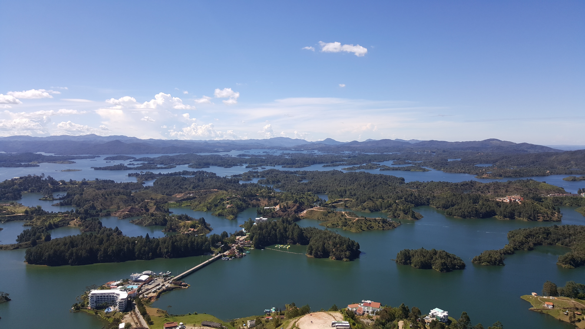
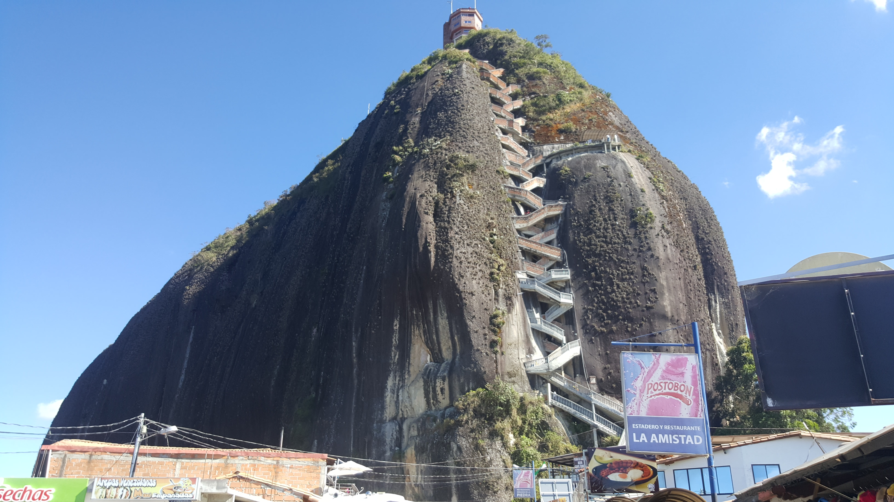

<h1>Travel Adventures: Guatape, Colombia</h1>

15 de Octubre 2018

En está página voy a hablar un poco sobre uno de los sitios más bonitos que he visitado en mi vida, el hermoso Guatapé en Colombia. El pueblo está situado en el departamento de antioquia, y se encuentra unas 2 horas y media desde Medellín. El pueblo de Guatapé es muy lindo y viejo, con calles llenas de colores y casas con diseñas unicas. ¡Pero lo más destacado sin duda es el gran peñón! Alcanzando 2135 metros en su parte más alto, se puede decir que es bastante alto. Y claro, es dificíl subir todas las 740 escaleras, pero creéme cuando les digo que vale la pena subirlas.
¡Que vistas más hermosas!

<h2>Images to be used later in the text</h2>

 

